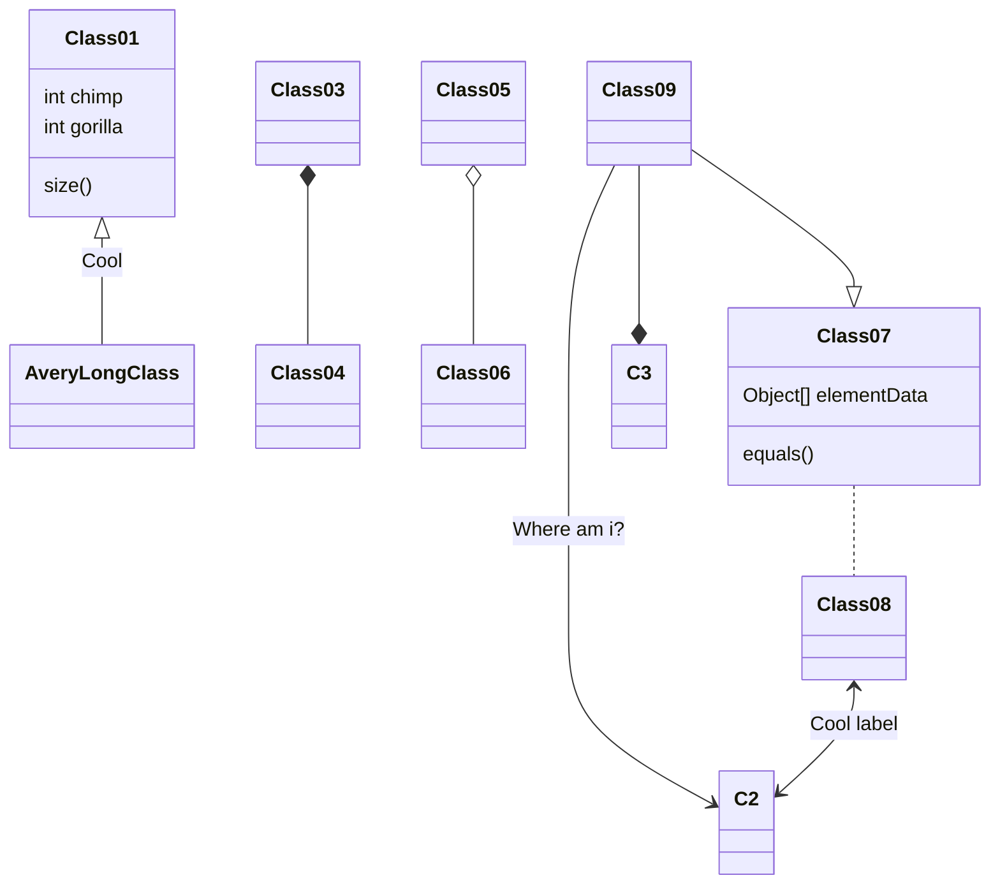

# idm-client
Interactive Devices Monitoring

Описание проекта

## 1 Структура проекта
Нарисуйте структуру проекта типа той что мы рисоыали в нвчвле

## 2 Клиент
- Функции
- Диаграмма классов

## 3 Сервер
- Функции
- Диаграмма классов

