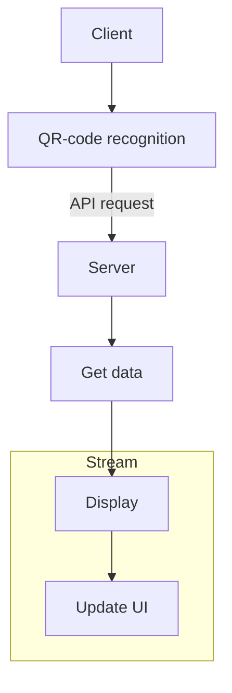
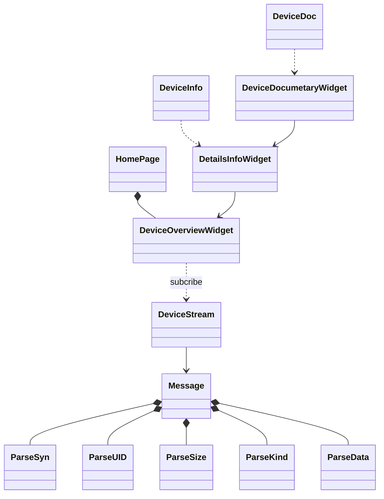
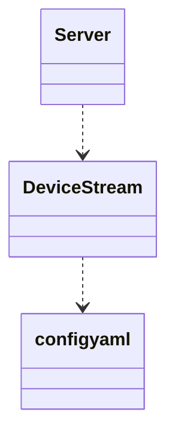

# idm-client
Interactive Devices Monitoring

Описание проекта

## 1 Project structure

## 2 Client
## Functions
- info:
	- [ ]  DeviceInfo - provides basic overview info by device
	- [ ] DeviceDoc - provides documentation file by device
- stream: 
	- [ ] DeviceStream - listening to the event stream from the server, receives status events for all devices, publishes a subscription to a certain device:
		- [ ] Message - reads and extracts socket bytes into stream of application type
		- [ ] ParseSyn - parses synchronization data from the data stream received from `Message`
		- [ ] ParseUid - extracts the unique identifier (UID) of a device
		- [ ] ParseKind - determines the type of event (kind)
		- [ ] ParseSize - extracts the size of the data
		- [ ] ParseData - parses the actual data
- widgets:
	- [ ] HomePage - the main page, displays video from camera
	- [ ] DeviceOverviewWidget - displays overview info card by detected device
	- [ ] DetailsInfoWidget - displays detailed info by detected device

## UML diagram

## 3 Server
## Functions
- [ ] DeviceStream - produces events by device
- [ ] Server - opens Socket server, creates DeviceStream's specified in the `config.yaml`
- [ ] ApiServer - provides Overview info and DocInfo by devices

## UML diagram

